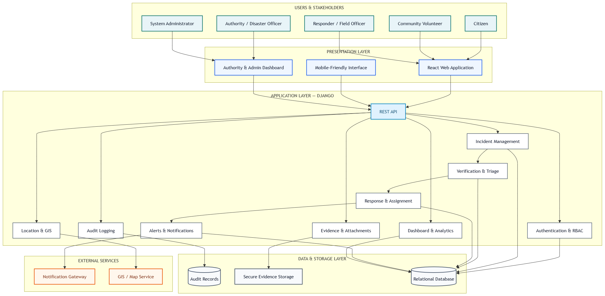
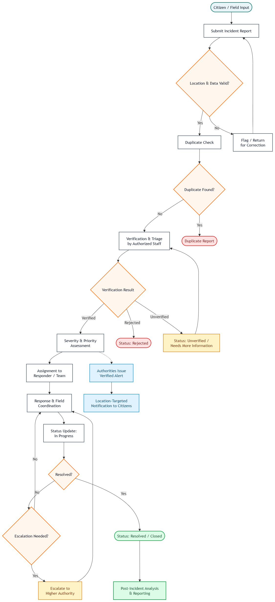
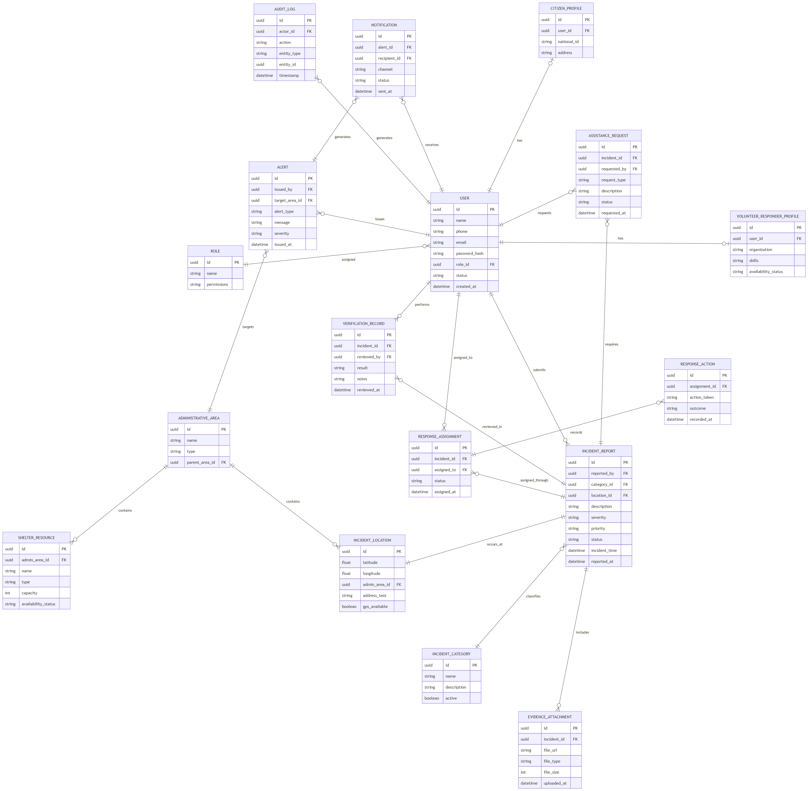

# Coastal Disaster Reporting & Crisis Management System — Frontend

Web/mobile-friendly frontend for the **Citizen Participation-Based Coastal Disaster Reporting & Crisis Management System**, enabling citizens, volunteers, responders, and authorities to report, verify, and coordinate response to coastal disasters in Bangladesh.

## Overview

The frontend provides role-specific interfaces:
- **Citizens** — submit disaster reports, view verified alerts, track their own report status.
- **Volunteers / Responders** — view assigned incidents, update field status and actions.
- **Local Authority / Disaster Management Officer** — verify/prioritize incidents, monitor maps & dashboards, issue alerts.
- **System Administrator** — manage users, roles, categories, and configurations.

## Tech Stack

| Layer | Technology |
|---|---|
| Framework | React.js / Next.js (or responsive PWA) |
| Mobile | PWA (Flutter/React Native if native GPS/camera/offline needed) |
| Styling | Tailwind CSS |
| Maps/GIS | OpenStreetMap-based / Leaflet |
| State/Data | REST API integration (Django backend) |
| Auth | JWT-based login with role-based UI rendering |

## Core Features

- **Auth Flows** — Signup, login, logout, password/account recovery, role-based routing.
- **Citizen Reporting Form** — Category, description, severity, date/time, GPS auto-capture or manual location pin, photo/video evidence upload (with size/type limits), and client-side validation for incomplete submissions.
- **My Reports** — Citizens can view status/history of their own submitted reports (Submitted → Under Review → Verified → Assigned → In Progress → Resolved/Rejected).
- **Interactive Map View** — Visualize incidents with filters by location, category, severity, priority, and status (Leaflet/OSM-based).
- **Response Coordination Dashboard** — Assign incidents to responders, track response actions, manage shelter/rescue/medical/food-water resource records.
- **Alerts & Notifications Panel** — Display official verified alerts distinctly from unverified citizen reports; support in-app/push notification display.

  ## Design & Architecture

The system design and architecture documentation is maintained in the `docs/diagrams/` directory.

### System Architecture



### Incident Lifecycle Flowchart



### Entity Relationship Diagram



### Source Diagram Files

The editable draw.io source files are also available in the `docs/diagrams/` directory:

- [System Architecture Diagram](docs/diagrams/System-Architecture-Diagram.drawio)
- [Incident Lifecycle Flowchart](docs/diagrams/Coastal-Disaster-Flowchart.drawio)
- [Entity Relationship Diagram](docs/diagrams/Coastal-Disaster-ER-Diagram.drawio)

## UI/UX Design

The UI wireframes and interactive prototype were designed in Figma.

[View Interactive Figma Prototype](https://www.figma.com/proto/M6jS3H4BwvP4joOavhc2bq/Coastal-Disaster-Management---UI-Wireframes?node-id=0-1&t=qd86SSCeSWhEtwl1-1)

### UI Wireframe Screens

- Citizen Dashboard
- Report Disaster
- Report Confirmation
- My Reports
- Landing Page

The exported UI wireframe previews are available in the `docs/ui-wireframes/` directory.

## Getting Started

### Prerequisites
- Node.js 18+
- npm or yarn

### Installation
```bash
git clone https://github.com/sumonstr12/Coastal-Solution-Frontend.git
cd Coastal-Solution-Frontend
npm install
```

### Run Development Server
```bash
npm run dev
```

### Build for Production
```bash
npm run build
```

## Project Structure (suggested)

```
src/
├── components/       # Reusable UI components (navbar, modals, cards)
├── pages/            # Role-based pages (citizen, responder, admin dashboards)
├── features/
│   ├── auth/
│   ├── reports/
│   ├── verification/
│   ├── alerts/
│   ├── dashboard/
│   └── map/
├── services/         # API integration layer
├── hooks/
└── utils/
```
this is initaial structure. May be change in future if needed.

## User Roles & Access

| Role | Key Screens |
|---|---|
| Citizen | Report form, My Reports, Alerts feed |
| Volunteer | Assigned incidents, field update form |
| Responder | Assigned incidents, response action log |
| Local Authority | Map dashboard, incident filters |
| Disaster Mgmt Officer | Verification queue, priority assignment, alert publishing |
| Admin | User/role management, categories, audit logs |

## Testing

- Usability testing with representative citizen and responder workflows
- Role/permission-based UI access testing
- Offline/intermittent-network behavior testing

## Future Enhancements

- USSD/SMS fallback reporting flow (companion to app)
- Predictive risk map overlays (cyclone/flood/storm-surge exposure)
- Community trust/reputation indicators for repeated reporters

## Acknowledgement

Built as part of an academic project — Discipline of CSE, Khulna University.
